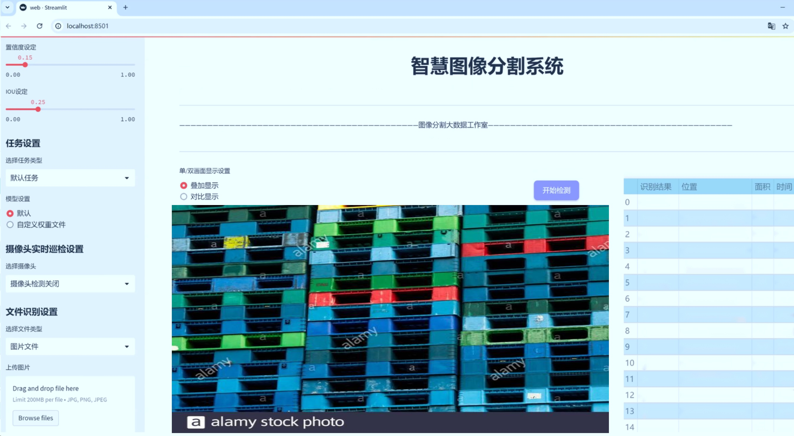
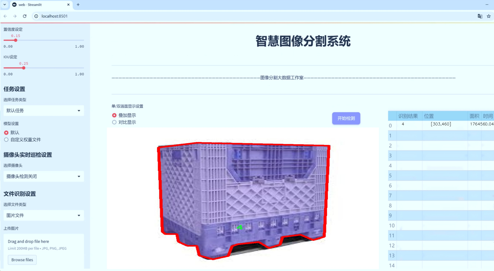
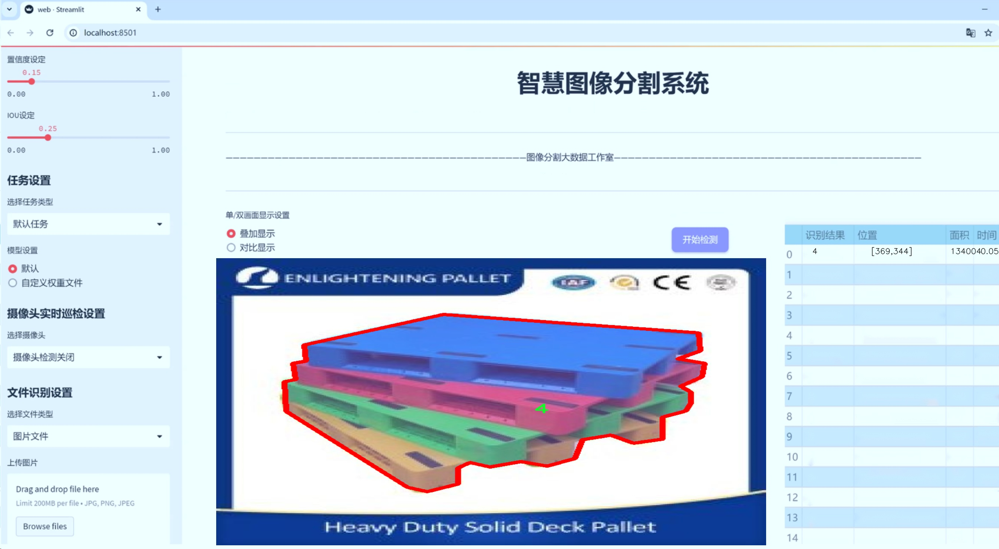
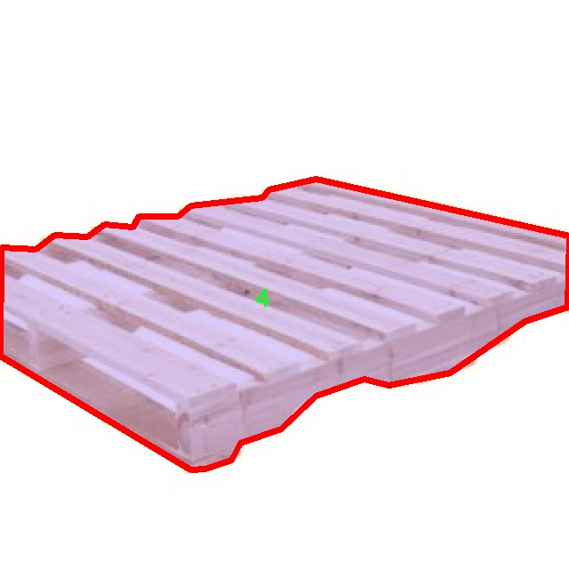
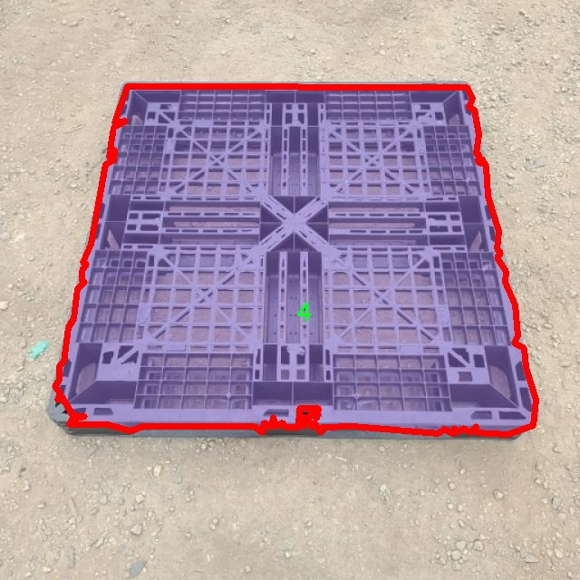
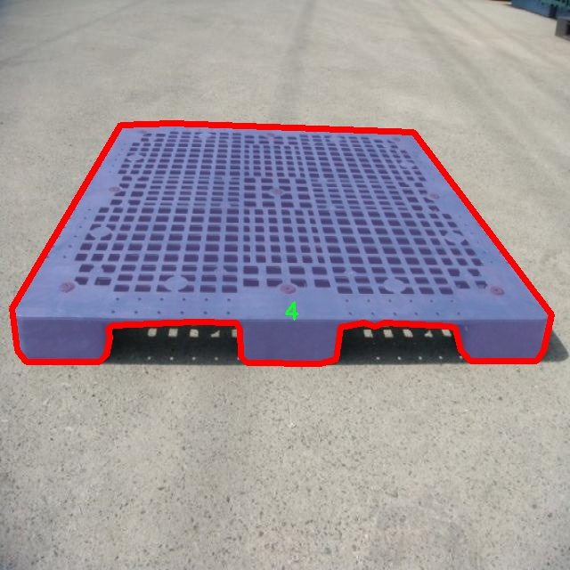
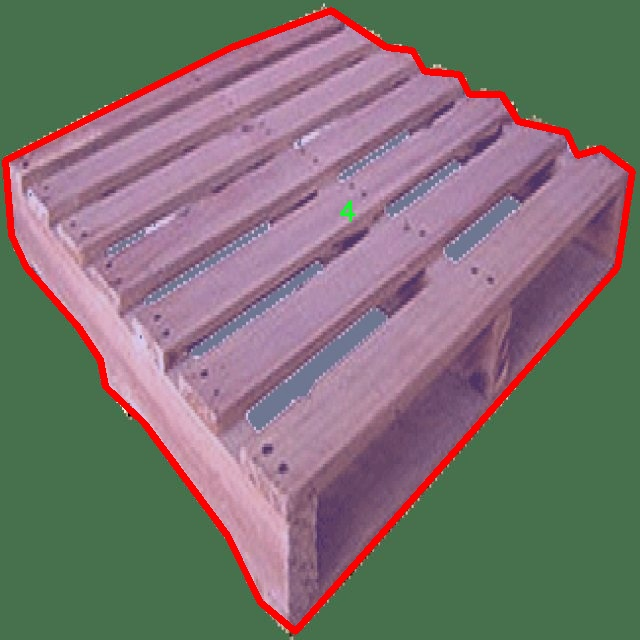
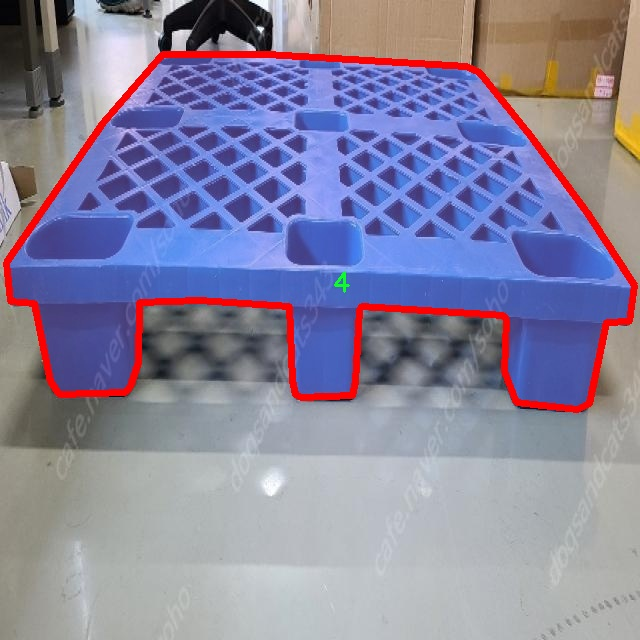

# 托盘图像分割系统： yolov8-seg-goldyolo

### 1.研究背景与意义

[参考博客](https://gitee.com/YOLOv8_YOLOv11_Segmentation_Studio/projects)

[博客来源](https://kdocs.cn/l/cszuIiCKVNis)

研究背景与意义

在现代物流和仓储管理中，托盘作为货物运输和存储的基本单元，其有效管理和识别对于提高工作效率、降低成本以及优化资源配置具有重要意义。随着电子商务的迅猛发展，货物种类和数量的急剧增加，使得传统的人工识别和管理方式逐渐显得力不从心。因此，自动化的图像识别技术在托盘管理中的应用愈发重要。近年来，深度学习技术的迅猛发展为图像处理提供了新的解决方案，尤其是目标检测和实例分割技术的进步，使得对托盘及其上货物的自动识别和分割成为可能。

YOLO（You Only Look Once）系列模型因其高效的实时检测能力而受到广泛关注。YOLOv8作为该系列的最新版本，结合了更深层次的网络结构和更先进的特征提取技术，能够在保持高精度的同时显著提高检测速度。然而，针对托盘图像的实例分割任务，YOLOv8的标准模型可能无法充分满足特定应用场景的需求。因此，基于YOLOv8的改进，开发一个专门针对托盘图像的分割系统，将为物流行业带来显著的技术进步。

本研究的核心在于利用一个包含1400张图像的托盘数据集，进行YOLOv8模型的改进与训练。该数据集涵盖了五个类别的托盘图像，涵盖了不同的环境和货物配置，为模型的训练提供了丰富的样本。通过对这些图像进行实例分割，不仅可以实现对托盘及其上货物的精确识别，还能够提取出各个物体的边界信息，为后续的自动化处理提供基础数据。这种分割技术在实际应用中，可以有效支持仓库管理系统的智能化升级，实现对托盘的快速定位、分类和追踪。

此外，基于改进YOLOv8的托盘图像分割系统的研究，具有重要的理论和实践意义。在理论层面，该研究将推动目标检测和实例分割领域的技术进步，尤其是在处理复杂背景和多类目标的情况下，探索更为高效的算法改进方案。在实践层面，研究成果可以广泛应用于智能仓储、自动化物流、货物追踪等多个领域，为企业提供高效的解决方案，提升整体运营效率。

综上所述，基于改进YOLOv8的托盘图像分割系统的研究，不仅具有重要的学术价值，还能为实际应用提供切实可行的技术支持，推动物流行业的智能化转型。通过对托盘图像的深入分析与处理，未来将为实现更高效的物流管理和资源配置奠定坚实的基础。

### 2.图片演示







注意：本项目提供完整的训练源码数据集和训练教程,由于此博客编辑较早,暂不提供权重文件（best.pt）,需要按照6.训练教程进行训练后实现上图效果。

### 3.视频演示

[3.1 视频演示](https://www.bilibili.com/video/BV1eXUmYXEqZ/)

### 4.数据集信息

##### 4.1 数据集类别数＆类别名

nc: 5
names: ['0', '1', '2', '3', '4']


##### 4.2 数据集信息简介

数据集信息展示

在本研究中，我们使用的数据集名为“4. pallet”，该数据集专门设计用于训练和改进YOLOv8-seg模型，以实现托盘图像的高效分割。随着工业自动化和智能仓储的迅速发展，托盘图像的精确识别与分割变得愈发重要。该数据集包含了多种托盘图像，旨在为深度学习模型提供丰富的训练样本，以提升其在实际应用中的表现。

“4. pallet”数据集包含五个类别，分别标记为‘0’，‘1’，‘2’，‘3’和‘4’。这些类别可能代表不同类型的托盘、托盘上的货物、不同的环境背景或其他相关特征。通过对这些类别的细致划分，研究者能够更好地训练模型，使其在复杂场景中进行准确的图像分割。每个类别的样本数量和多样性都经过精心设计，以确保模型在训练过程中能够学习到丰富的特征，从而在实际应用中具备更强的泛化能力。

数据集中的图像涵盖了不同的拍摄角度、光照条件和背景环境，这些因素对模型的训练效果至关重要。通过提供多样化的样本，数据集能够帮助模型适应各种实际应用场景，提升其在不同环境下的识别能力。此外，数据集还包含了经过标注的图像，标注信息详细记录了每个类别在图像中的位置和形状，为模型的训练提供了可靠的监督信号。

在训练过程中，YOLOv8-seg模型将利用这些标注信息进行学习，通过不断调整其内部参数，以实现对托盘图像的精确分割。模型的目标是能够在实时处理的情况下，快速而准确地识别出图像中的托盘及其相关物体。这一过程不仅需要强大的计算能力，还需要高质量的数据集作为支撑。正因如此，“4. pallet”数据集的构建显得尤为重要。

为了确保数据集的有效性和可靠性，研究团队在数据采集和标注过程中采取了严格的标准。每张图像都经过多轮审核，以确保标注的准确性和一致性。这种高标准的质量控制措施，使得“4. pallet”数据集成为训练YOLOv8-seg模型的理想选择，能够为模型提供坚实的基础。

总之，“4. pallet”数据集不仅为托盘图像分割系统的训练提供了丰富的样本和标注信息，还通过其多样性和高质量的特征，助力于YOLOv8-seg模型的改进与优化。随着该模型在实际应用中的推广，我们期待它能够在智能仓储、物流管理等领域发挥重要作用，为行业的发展带来新的机遇和挑战。











### 5.项目依赖环境部署教程（零基础手把手教学）

[5.1 环境部署教程链接（零基础手把手教学）](https://www.bilibili.com/video/BV1jG4Ve4E9t/?vd_source=bc9aec86d164b67a7004b996143742dc)


[5.2 安装Python虚拟环境创建和依赖库安装视频教程链接（零基础手把手教学）](https://www.bilibili.com/video/BV1nA4VeYEze/?vd_source=bc9aec86d164b67a7004b996143742dc)

### 6.手把手YOLOV8-seg训练视频教程（零基础手把手教学）

[6.1 手把手YOLOV8-seg训练视频教程（零基础小白有手就能学会）](https://www.bilibili.com/video/BV1cA4VeYETe/?vd_source=bc9aec86d164b67a7004b996143742dc)


按照上面的训练视频教程链接加载项目提供的数据集，运行train.py即可开始训练



     Epoch   gpu_mem       box       obj       cls    labels  img_size
     1/200     0G   0.01576   0.01955  0.007536        22      1280: 100%|██████████| 849/849 [14:42<00:00,  1.04s/it]
               Class     Images     Labels          P          R     mAP@.5 mAP@.5:.95: 100%|██████████| 213/213 [01:14<00:00,  2.87it/s]
                 all       3395      17314      0.994      0.957      0.0957      0.0843

     Epoch   gpu_mem       box       obj       cls    labels  img_size
     2/200     0G   0.01578   0.01923  0.007006        22      1280: 100%|██████████| 849/849 [14:44<00:00,  1.04s/it]
               Class     Images     Labels          P          R     mAP@.5 mAP@.5:.95: 100%|██████████| 213/213 [01:12<00:00,  2.95it/s]
                 all       3395      17314      0.996      0.956      0.0957      0.0845

     Epoch   gpu_mem       box       obj       cls    labels  img_size
     3/200     0G   0.01561    0.0191  0.006895        27      1280: 100%|██████████| 849/849 [10:56<00:00,  1.29it/s]
               Class     Images     Labels          P          R     mAP@.5 mAP@.5:.95: 100%|███████   | 187/213 [00:52<00:00,  4.04it/s]
                 all       3395      17314      0.996      0.957      0.0957      0.0845


### 7.50+种全套YOLOV8-seg创新点加载调参实验视频教程（一键加载写好的改进模型的配置文件）

[7.1 50+种全套YOLOV8-seg创新点加载调参实验视频教程（一键加载写好的改进模型的配置文件）](https://www.bilibili.com/video/BV1Hw4VePEXv/?vd_source=bc9aec86d164b67a7004b996143742dc)

### YOLOV8-seg算法简介

原始YOLOV8-seg算法原理

YOLO（You Only Look Once）系列算法自其首次提出以来，便以其高效的目标检测能力和简洁的网络结构在计算机视觉领域取得了显著的成功。2023年，Ultralytics公司推出了YOLOv8系列，其中YOLOv8-seg作为其重要的变种，专注于目标检测与分割任务的结合，进一步提升了模型在复杂场景下的表现。YOLOv8-seg不仅延续了YOLO系列的核心思想，还在网络结构和训练策略上进行了多项创新，以适应多样化的应用需求。

YOLOv8-seg的网络结构可以分为三个主要部分：输入端（Input）、主干网络（Backbone）和检测端（Head）。在输入端，YOLOv8-seg接受经过预处理的图像数据，确保输入图像的尺寸和格式符合模型要求。主干网络采用了CSP（Cross Stage Partial）结构，通过将特征提取过程分为卷积和连接两个部分，提升了特征提取的效率和准确性。CSP结构的引入使得网络在保持较高计算效率的同时，能够提取更丰富的特征信息，为后续的目标检测和分割任务奠定了坚实的基础。

在YOLOv8-seg中，特征增强网络采用了PAN-FPN（Path Aggregation Network - Feature Pyramid Network）结构，这一设计旨在实现多尺度特征的融合。PAN-FPN通过将不同层次的特征图进行有效的融合，确保模型能够在不同尺度下对目标进行准确的检测和分割。与传统的FPN结构相比，PAN-FPN在特征传递过程中引入了更为复杂的路径聚合机制，使得高层特征与低层特征之间的联系更加紧密，从而提升了模型对小目标和复杂背景的适应能力。

YOLOv8-seg的检测头部分则采用了创新的解耦合头结构，将分类和回归任务分离开来。传统的YOLO系列通常将分类和回归任务耦合在一起，这在一定程度上限制了模型的灵活性和性能。通过解耦合，YOLOv8-seg能够让分类和回归各自专注于自身的任务，从而有效减少了在复杂场景下的定位误差和分类错误。此外，YOLOv8-seg引入了Anchor-Free的目标检测方法，摒弃了传统的锚框机制，直接通过回归方式预测目标的位置和大小。这一创新使得模型在处理不同尺度和形状的目标时更加灵活，能够快速聚焦于目标的实际边界框，显著提升了检测精度。

在训练过程中，YOLOv8-seg采用了一系列先进的数据增强策略，以提高模型的泛化能力和鲁棒性。特别是在最后的训练阶段，YOLOv8-seg关闭了马赛克增强，这一策略有助于减少过拟合现象，并使模型更好地适应真实场景中的数据分布。此外，YOLOv8-seg还引入了动态Task-Aligned Assigner样本分配策略，通过智能化的样本分配机制，确保模型在训练过程中能够接触到多样化的样本，提高了训练效率和效果。

在损失函数的设计上，YOLOv8-seg采用了BCELoss（Binary Cross Entropy Loss）作为分类损失，同时结合DFLLoss和CIoULoss作为回归损失。这一组合不仅提高了模型在分类任务上的表现，还增强了回归任务的准确性，使得模型在目标定位和分割上都能取得优异的结果。BCELoss在处理二分类问题时表现出色，而DFLLoss和CIoULoss则在目标边界框的回归过程中提供了更为精确的损失反馈，从而推动模型的整体性能提升。

总的来说，YOLOv8-seg算法在YOLO系列的基础上进行了多项重要的创新和改进，充分利用了现代深度学习技术的优势，构建了一个高效、灵活且强大的目标检测与分割模型。通过合理的网络结构设计、先进的训练策略以及精确的损失函数，YOLOv8-seg不仅能够满足实时检测的需求，还能够在复杂的视觉任务中展现出卓越的性能。这使得YOLOv8-seg在众多应用场景中，如自动驾驶、安防监控和医疗影像分析等，具备了广泛的应用潜力和价值。随着YOLOv8-seg的不断发展和优化，未来的目标检测与分割任务将迎来更为广阔的前景。


### 9.系统功能展示（检测对象为举例，实际内容以本项目数据集为准）

图9.1.系统支持检测结果表格显示

  图9.2.系统支持置信度和IOU阈值手动调节

  图9.3.系统支持自定义加载权重文件best.pt(需要你通过步骤5中训练获得)

  图9.4.系统支持摄像头实时识别

  图9.5.系统支持图片识别

  图9.6.系统支持视频识别

  图9.7.系统支持识别结果文件自动保存

  图9.8.系统支持Excel导出检测结果数据


### 10.50+种全套YOLOV8-seg创新点原理讲解（非科班也可以轻松写刊发刊，V11版本正在科研待更新）

#### 10.1 由于篇幅限制，每个创新点的具体原理讲解就不一一展开，具体见下列网址中的创新点对应子项目的技术原理博客网址【Blog】：


[10.1 50+种全套YOLOV8-seg创新点原理讲解链接](https://gitee.com/qunmasj/good)

#### 10.2 部分改进模块原理讲解(完整的改进原理见上图和技术博客链接)【如果此小节的图加载失败可以通过CSDN或者Github搜索该博客的标题访问原始博客，原始博客图片显示正常】
### YOLOv8简介

YOLOv8 是 Ultralytics 公司继 YOLOv5 算法之后开发的下一代算法模型，目前支持图像分类、物体检测和实例分割任务。YOLOv8 是一个 SOTA 模型，它建立在之前YOLO 系列模型的成功基础上，并引入了新的功能和改进，以进一步提升性能和灵活性。具体创新包括：一个新的骨干网络、一个新的 Ancher-Free 检测头和一个新的损失函数，可以在从 CPU 到 GPU 的各种硬件平台上运行。注意到ultralytics 并没有直接将开源库命名为 YOLOv8，而是直接使用 Ultralytics这个单词，原因是Ultralytics这个库的定位是算法框架，而非特指某一个特定算法，其希望这个库不仅仅能够用于 YOLO 系列模型，同时也能支持其他的视觉任务如图像分类、实例分割等。下图画图YOLOv8目标检测算法同其他YOLO系列算法（YOLOv5、6、7）的实验对比图，左边是模型参数量对比，右边是速度对比。


下面两个表分别是YOLOv8和YOLOv5（v7.0版本）官方在 COCO Val 2017 数据集上测试结果，从中看出 YOLOv8 相比 YOLOv5 精度提升大，但是 N/S/M 模型相应的参数量、FLOPS等提高了不少。


#### YOLOv8概述
提供了一个全新的SOTA模型，和YOLOv5一样，基于缩放系数也提供了 N/S/M/L/X 尺度的不同大小模型，用于满足不同场景需求，同时支持图像分类、目标检测、实例分割和姿态检测任务
在骨干网络和Neck部分将YOLOv5的C3结构换成了梯度流更丰富的 C2f 结构，并对不同尺度模型调整了不同的通道数，大幅提升了模型性能；需要注意的是C2f 模块中存在Split等操作对特定硬件部署没有之前那么友好


Head部分换成了目前主流的解耦头结构，将分类和检测头分离，同时也从 Anchor-Based换成了Anchor-Free Loss
计算方面采用了 TaskAlignedAssigner 正样本分配策略，并引入了 Distribution Focal Loss
下图画出YOLOv8目标检测算法的整体结构图


#### YOLOv8模型
YOLOv8目标检测算法的模型配置文件如下：


从配置文件可以看出，YOLOv8与YOLOv5模型最明显的差异是使用C2F模块替换了原来的C3模块，两个模块的结构图下图所示。


另外Head 部分变化最大，从原先的耦合头变成了解耦头，并且从 YOLOv5 的 Anchor-Based 变成了 Anchor-Free。其结构对比图如下所示：

### RepViT简介

近年来，与轻量级卷积神经网络(cnn)相比，轻量级视觉变压器(ViTs)在资源受限的移动设备上表现出了更高的性能和更低的延迟。这种改进通常归功于多头自注意模块，它使模型能够学习全局表示。然而，轻量级vit和轻量级cnn之间的架构差异还没有得到充分的研究。在这项研究中，我们重新审视了轻量级cnn的高效设计，并强调了它们在移动设备上的潜力。通过集成轻量级vit的高效架构选择，我们逐步增强了标准轻量级CNN的移动友好性，特别是MobileNetV3。这就产生了一个新的纯轻量级cnn家族，即RepViT。大量的实验表明，RepViT优于现有的轻型vit，并在各种视觉任务中表现出良好的延迟。在ImageNet上，RepViT在iPhone 12上以近1ms的延迟实现了超过80%的top-1精度，据我们所知，这是轻量级模型的第一次。

#### RepViT简介
轻量级模型研究一直是计算机视觉任务中的一个焦点，其目标是在降低计算成本的同时达到优秀的性能。轻量级模型与资源受限的移动设备尤其相关，使得视觉模型的边缘部署成为可能。在过去十年中，研究人员主要关注轻量级卷积神经网络（CNNs）的设计，提出了许多高效的设计原则，包括可分离卷积 、逆瓶颈结构 、通道打乱 和结构重参数化等，产生了 MobileNets ，ShuffleNets和 RepVGG 等代表性模型。

另一方面，视觉 Transformers（ViTs）成为学习视觉表征的另一种高效方案。与 CNNs 相比，ViTs 在各种计算机视觉任务中表现出了更优越的性能。然而，ViT 模型一般尺寸很大，延迟很高，不适合资源受限的移动设备。因此，研究人员开始探索 ViT 的轻量级设计。许多高效的ViTs设计原则被提出，大大提高了移动设备上 ViTs 的计算效率，产生了EfficientFormers ，MobileViTs等代表性模型。这些轻量级 ViTs 在移动设备上展现出了相比 CNNs 的更强的性能和更低的延迟。

轻量级 ViTs 优于轻量级 CNNs 的原因通常归结于多头注意力模块，该模块使模型能够学习全局表征。然而，轻量级 ViTs 和轻量级 CNNs 在块结构、宏观和微观架构设计方面存在值得注意的差异，但这些差异尚未得到充分研究。这自然引出了一个问题：轻量级 ViTs 的架构选择能否提高轻量级 CNN 的性能？在这项工作中，我们结合轻量级 ViTs 的架构选择，重新审视了轻量级 CNNs 的设计。我们的旨在缩小轻量级 CNNs 与轻量级 ViTs 之间的差距，并强调前者与后者相比在移动设备上的应用潜力。


在 ConvNeXt 中，参考该博客提出的基于 ResNet50 架构的基础上通过严谨的理论和实验分析，最终设计出一个非常优异的足以媲美 Swin-Transformer 的纯卷积神经网络架构。同样地，RepViT也是主要通过将轻量级 ViTs 的架构设计逐步整合到标准轻量级 CNN，即MobileNetV3-L，来对其进行针对性地改造（魔改）。在这个过程中，作者们考虑了不同粒度级别的设计元素，并通过一系列步骤达到优化的目标。


详细优化步骤如下：

#### 训练配方的对齐
论文中引入了一种衡量移动设备上延迟的指标，并将训练策略与现有的轻量级 ViTs 对齐。这一步骤主要是为了确保模型训练的一致性，其涉及两个概念，即延迟度量和训练策略的调整。

#### 延迟度量指标
为了更准确地衡量模型在真实移动设备上的性能，作者选择了直接测量模型在设备上的实际延迟，以此作为基准度量。这个度量方法不同于之前的研究，它们主要通过FLOPs或模型大小等指标优化模型的推理速度，这些指标并不总能很好地反映在移动应用中的实际延迟。

#### 训练策略的对齐
这里，将 MobileNetV3-L 的训练策略调整以与其他轻量级 ViTs 模型对齐。这包括使用 AdamW 优化器-ViTs 模型必备的优化器，进行 5 个 epoch 的预热训练，以及使用余弦退火学习率调度进行 300 个 epoch 的训练。尽管这种调整导致了模型准确率的略微下降，但可以保证公平性。

#### 块设计的优化
基于一致的训练设置，作者们探索了最优的块设计。块设计是 CNN 架构中的一个重要组成部分，优化块设计有助于提高网络的性能。

#### 分离 Token 混合器和通道混合器
这块主要是对 MobileNetV3-L 的块结构进行了改进，分离了令牌混合器和通道混合器。原来的 MobileNetV3 块结构包含一个 1x1 扩张卷积，然后是一个深度卷积和一个 1x1 的投影层，然后通过残差连接连接输入和输出。在此基础上，RepViT 将深度卷积提前，使得通道混合器和令牌混合器能够被分开。为了提高性能，还引入了结构重参数化来在训练时为深度滤波器引入多分支拓扑。最终，作者们成功地在 MobileNetV3 块中分离了令牌混合器和通道混合器，并将这种块命名为 RepViT 块。

#### 降低扩张比例并增加宽度
在通道混合器中，原本的扩张比例是 4，这意味着 MLP 块的隐藏维度是输入维度的四倍，消耗了大量的计算资源，对推理时间有很大的影响。为了缓解这个问题，我们可以将扩张比例降低到 2，从而减少了参数冗余和延迟，使得 MobileNetV3-L 的延迟降低到 0.65ms。随后，通过增加网络的宽度，即增加各阶段的通道数量，Top-1 准确率提高到 73.5%，而延迟只增加到 0.89ms！

#### 宏观架构元素的优化
在这一步，本文进一步优化了MobileNetV3-L在移动设备上的性能，主要是从宏观架构元素出发，包括 stem，降采样层，分类器以及整体阶段比例。通过优化这些宏观架构元素，模型的性能可以得到显著提高。

#### 浅层网络使用卷积提取器
ViTs 通常使用一个将输入图像分割成非重叠补丁的 “patchify” 操作作为 stem。然而，这种方法在训练优化性和对训练配方的敏感性上存在问题。因此，作者们采用了早期卷积来代替，这种方法已经被许多轻量级 ViTs 所采纳。对比之下，MobileNetV3-L 使用了一个更复杂的 stem 进行 4x 下采样。这样一来，虽然滤波器的初始数量增加到24，但总的延迟降低到0.86ms，同时 top-1 准确率提高到 73.9%。

#### 更深的下采样层
在 ViTs 中，空间下采样通常通过一个单独的补丁合并层来实现。因此这里我们可以采用一个单独和更深的下采样层，以增加网络深度并减少由于分辨率降低带来的信息损失。具体地，作者们首先使用一个 1x1 卷积来调整通道维度，然后将两个 1x1 卷积的输入和输出通过残差连接，形成一个前馈网络。此外，他们还在前面增加了一个 RepViT 块以进一步加深下采样层，这一步提高了 top-1 准确率到 75.4%，同时延迟为 0.96ms。

#### 更简单的分类器
在轻量级 ViTs 中，分类器通常由一个全局平均池化层后跟一个线性层组成。相比之下，MobileNetV3-L 使用了一个更复杂的分类器。因为现在最后的阶段有更多的通道，所以作者们将它替换为一个简单的分类器，即一个全局平均池化层和一个线性层，这一步将延迟降低到 0.77ms，同时 top-1 准确率为 74.8%。

#### 整体阶段比例
阶段比例代表了不同阶段中块数量的比例，从而表示了计算在各阶段中的分布。论文选择了一个更优的阶段比例 1:1:7:1，然后增加网络深度到 2:2:14:2，从而实现了一个更深的布局。这一步将 top-1 准确率提高到 76.9%，同时延迟为 1.02 ms。

#### 卷积核大小的选择
众所周知，CNNs 的性能和延迟通常受到卷积核大小的影响。例如，为了建模像 MHSA 这样的远距离上下文依赖，ConvNeXt 使用了大卷积核，从而实现了显著的性能提升。然而，大卷积核对于移动设备并不友好，因为它的计算复杂性和内存访问成本。MobileNetV3-L 主要使用 3x3 的卷积，有一部分块中使用 5x5 的卷积。作者们将它们替换为3x3的卷积，这导致延迟降低到 1.00ms，同时保持了76.9%的top-1准确率。

#### SE 层的位置
自注意力模块相对于卷积的一个优点是根据输入调整权重的能力，这被称为数据驱动属性。作为一个通道注意力模块，SE层可以弥补卷积在缺乏数据驱动属性上的限制，从而带来更好的性能。MobileNetV3-L 在某些块中加入了SE层，主要集中在后两个阶段。然而，与分辨率较高的阶段相比，分辨率较低的阶段从SE提供的全局平均池化操作中获得的准确率提升较小。作者们设计了一种策略，在所有阶段以交叉块的方式使用SE层，从而在最小的延迟增量下最大化准确率的提升，这一步将top-1准确率提升到77.4%，同时延迟降低到0.87ms。

注意！【这一点其实百度在很早前就已经做过实验比对得到过这个结论了，SE 层放置在靠近深层的地方效果好】

#### 微观设计的调整
RepViT 通过逐层微观设计来调整轻量级 CNN，这包括选择合适的卷积核大小和优化挤压-激励（Squeeze-and-excitation，简称SE）层的位置。这两种方法都能显著改善模型性能。

#### 网络架构
最终，通过整合上述改进策略，我们便得到了模型RepViT的整体架构，该模型有多个变种，例如RepViT-M1/M2/M3。同样地，不同的变种主要通过每个阶段的通道数和块数来区分。


### 11.项目核心源码讲解（再也不用担心看不懂代码逻辑）

#### 11.1 ultralytics\utils\callbacks\dvc.py

以下是经过精简和注释的核心代码部分：

```python
# 导入必要的库
from ultralytics.utils import LOGGER, SETTINGS, TESTS_RUNNING, checks
import os
import re
from pathlib import Path

# 尝试导入 DVCLive 并进行版本检查
try:
    assert not TESTS_RUNNING  # 确保不在测试模式下
    assert SETTINGS['dvc'] is True  # 确保集成已启用
    import dvclive
    assert checks.check_version('dvclive', '2.11.0', verbose=True)
    live = None  # DVCLive 日志实例
    _processed_plots = {}  # 存储已处理的图表
    _training_epoch = False  # 标记当前是否为训练周期

except (ImportError, AssertionError, TypeError):
    dvclive = None  # 如果导入失败，则将 dvclive 设置为 None

def _log_images(path, prefix=''):
    """记录指定路径的图像，使用 DVCLive 进行日志记录。"""
    if live:  # 如果 DVCLive 实例存在
        name = path.name
        # 通过批次分组图像，以便在 UI 中启用滑块
        m = re.search(r'_batch(\d+)', name)
        if m:
            ni = m[1]
            new_stem = re.sub(r'_batch(\d+)', '_batch', path.stem)
            name = (Path(new_stem) / ni).with_suffix(path.suffix)
        live.log_image(os.path.join(prefix, name), path)  # 记录图像

def _log_plots(plots, prefix=''):
    """记录训练进度的图像，如果它们尚未被处理。"""
    for name, params in plots.items():
        timestamp = params['timestamp']
        if _processed_plots.get(name) != timestamp:  # 检查图表是否已处理
            _log_images(name, prefix)  # 记录图像
            _processed_plots[name] = timestamp  # 更新已处理图表的时间戳

def _log_confusion_matrix(validator):
    """使用 DVCLive 记录给定验证器的混淆矩阵。"""
    targets = []
    preds = []
    matrix = validator.confusion_matrix.matrix
    names = list(validator.names.values())
    if validator.confusion_matrix.task == 'detect':
        names += ['background']  # 如果任务是检测，添加背景类

    for ti, pred in enumerate(matrix.T.astype(int)):
        for pi, num in enumerate(pred):
            targets.extend([names[ti]] * num)  # 添加真实标签
            preds.extend([names[pi]] * num)  # 添加预测标签

    live.log_sklearn_plot('confusion_matrix', targets, preds, name='cf.json', normalized=True)  # 记录混淆矩阵

def on_pretrain_routine_start(trainer):
    """在预训练例程开始时初始化 DVCLive 日志记录器。"""
    try:
        global live
        live = dvclive.Live(save_dvc_exp=True, cache_images=True)  # 初始化 DVCLive
        LOGGER.info("DVCLive 检测到，自动记录已启用。")
    except Exception as e:
        LOGGER.warning(f'警告 ⚠️ DVCLive 安装但未正确初始化，未记录此运行。 {e}')

def on_fit_epoch_end(trainer):
    """在每个训练周期结束时记录训练指标和模型信息。"""
    global _training_epoch
    if live and _training_epoch:  # 如果 DVCLive 实例存在且当前为训练周期
        all_metrics = {**trainer.label_loss_items(trainer.tloss, prefix='train'), **trainer.metrics, **trainer.lr}
        for metric, value in all_metrics.items():
            live.log_metric(metric, value)  # 记录每个指标

        _log_plots(trainer.plots, 'train')  # 记录训练图表
        live.next_step()  # 进入下一个步骤
        _training_epoch = False  # 重置训练周期标记

def on_train_end(trainer):
    """在训练结束时记录最佳指标、图表和混淆矩阵。"""
    if live:
        all_metrics = {**trainer.label_loss_items(trainer.tloss, prefix='train'), **trainer.metrics, **trainer.lr}
        for metric, value in all_metrics.items():
            live.log_metric(metric, value, plot=False)  # 记录最佳指标

        _log_confusion_matrix(trainer.validator)  # 记录混淆矩阵
        live.end()  # 结束日志记录

# 回调函数字典
callbacks = {
    'on_pretrain_routine_start': on_pretrain_routine_start,
    'on_fit_epoch_end': on_fit_epoch_end,
    'on_train_end': on_train_end
} if dvclive else {}
```

### 代码说明：
1. **导入部分**：导入了必要的库和模块，包括日志记录、路径处理和正则表达式。
2. **DVCLive 初始化**：尝试导入 `dvclive` 并进行版本检查，确保集成正常工作。
3. **图像和图表记录**：定义了 `_log_images` 和 `_log_plots` 函数，用于记录训练过程中的图像和图表。
4. **混淆矩阵记录**：定义了 `_log_confusion_matrix` 函数，用于记录模型的混淆矩阵。
5. **训练过程中的回调**：定义了多个回调函数，如 `on_pretrain_routine_start`、`on_fit_epoch_end` 和 `on_train_end`，用于在训练的不同阶段记录日志。
6. **回调字典**：根据是否启用 `dvclive`，构建回调函数字典，以便在训练过程中调用。

这个文件是Ultralytics YOLO项目中的一个回调模块，主要用于集成DVCLive库，以便在训练过程中记录和可视化训练过程中的各种指标和图像。文件的开头部分导入了一些必要的模块和库，并进行了初步的检查，以确保DVCLive的集成是启用的，并且版本符合要求。

在文件中，首先定义了一个全局变量`live`，用于存储DVCLive的实例，以及一个字典`_processed_plots`，用于跟踪已经处理过的图像。接下来，定义了一些辅助函数来处理图像和图表的记录。例如，`_log_images`函数用于记录指定路径下的图像，并根据需要为图像添加前缀。`_log_plots`函数则用于记录训练过程中生成的图表，确保每个图表只被处理一次。

文件中还定义了一个`_log_confusion_matrix`函数，用于记录混淆矩阵，这是评估分类模型性能的重要工具。这个函数从验证器中提取目标和预测值，并使用DVCLive记录混淆矩阵的可视化结果。

接下来，文件定义了一系列回调函数，这些函数在训练的不同阶段被调用。`on_pretrain_routine_start`函数在预训练开始时初始化DVCLive记录器，并记录相关信息。`on_pretrain_routine_end`函数在预训练结束时记录训练过程中的图表。`on_train_start`函数在训练开始时记录训练参数。`on_train_epoch_start`函数在每个训练周期开始时设置一个全局变量，指示当前正在进行训练周期。

`on_fit_epoch_end`函数在每个训练周期结束时被调用，记录训练指标和模型信息，并推进到下一个步骤。最后，`on_train_end`函数在训练结束时记录最佳指标、图表和混淆矩阵，并结束DVCLive的记录。

文件的最后部分定义了一个字典`callbacks`，根据DVCLive是否可用来选择性地包含上述回调函数。这种设计使得在不同的环境中，程序能够灵活地处理训练过程中的日志记录。整体来看，这个文件的目的是为了增强模型训练过程中的可视化和监控，便于开发者分析和优化模型性能。

#### 11.2 ultralytics\engine\__init__.py

以下是对代码的核心部分进行保留和详细注释的示例：

```python
# Ultralytics YOLO 🚀, AGPL-3.0 license

# 导入必要的库
import torch  # 导入PyTorch库，用于深度学习模型的构建和训练

# 定义YOLO模型类
class YOLO:
    def __init__(self, model_path):
        # 初始化YOLO模型
        self.model = torch.load(model_path)  # 加载预训练的YOLO模型

    def predict(self, image):
        # 对输入图像进行预测
        with torch.no_grad():  # 在推理时不需要计算梯度
            predictions = self.model(image)  # 使用模型对图像进行预测
        return predictions  # 返回预测结果

# 使用示例
if __name__ == "__main__":
    yolo_model = YOLO('path/to/model.pt')  # 创建YOLO模型实例并加载模型
    image = torch.zeros((1, 3, 640, 640))  # 创建一个虚拟图像（示例）
    results = yolo_model.predict(image)  # 对图像进行预测
    print(results)  # 输出预测结果
```

### 代码注释说明：
1. **导入库**：首先导入了`torch`库，这是构建和训练深度学习模型的基础库。
2. **YOLO类**：定义了一个`YOLO`类，用于封装YOLO模型的功能。
   - `__init__`方法：初始化时加载预训练的YOLO模型。
   - `predict`方法：接收输入图像并返回模型的预测结果。在预测过程中使用`torch.no_grad()`来避免计算梯度，从而节省内存和加快推理速度。
3. **使用示例**：在主程序中创建YOLO模型实例，加载模型，并对一个虚拟图像进行预测，最后输出预测结果。

这样，代码的核心部分和功能得到了保留，同时提供了详细的中文注释以便理解。

该文件是Ultralytics YOLO项目的一部分，文件名为`__init__.py`，它通常用于标识一个Python包。在这个文件中，包含了一个注释，表明该项目是Ultralytics YOLO的实现，并且遵循AGPL-3.0许可证。

AGPL-3.0许可证是一种开源许可证，要求任何使用该软件的修改版本必须在同样的许可证下进行发布。这意味着如果有人对Ultralytics YOLO进行修改并将其发布，必须提供源代码，并允许其他人自由使用和修改。

虽然这个文件的代码非常简单，仅包含一行注释，但它在Python包中起到了重要的作用。`__init__.py`文件的存在使得Python能够将包含该文件的目录视为一个包，从而可以导入该包中的模块和功能。这种结构有助于组织代码，使得项目的不同部分可以被更好地管理和使用。

总的来说，`ultralytics\engine\__init__.py`文件是Ultralytics YOLO项目的一部分，标识了一个Python包，并声明了其开源许可证，尽管其内容非常简单，但在项目的结构和组织中起到了关键作用。

#### 11.3 ultralytics\models\yolo\classify\val.py

以下是代码中最核心的部分，并附上详细的中文注释：

```python
import torch
from ultralytics.data import ClassificationDataset, build_dataloader
from ultralytics.engine.validator import BaseValidator
from ultralytics.utils.metrics import ClassifyMetrics, ConfusionMatrix
from ultralytics.utils.plotting import plot_images

class ClassificationValidator(BaseValidator):
    """
    ClassificationValidator类用于基于分类模型的验证。
    该类扩展了BaseValidator类，提供了分类任务的相关功能。
    """

    def __init__(self, dataloader=None, save_dir=None, pbar=None, args=None, _callbacks=None):
        """初始化ClassificationValidator实例，设置数据加载器、保存目录、进度条和参数。"""
        super().__init__(dataloader, save_dir, pbar, args, _callbacks)
        self.targets = None  # 真实标签
        self.pred = None     # 预测结果
        self.args.task = 'classify'  # 设置任务类型为分类
        self.metrics = ClassifyMetrics()  # 初始化分类指标

    def init_metrics(self, model):
        """初始化混淆矩阵、类名以及top-1和top-5准确率。"""
        self.names = model.names  # 获取类名
        self.nc = len(model.names)  # 类别数量
        self.confusion_matrix = ConfusionMatrix(nc=self.nc, conf=self.args.conf, task='classify')  # 初始化混淆矩阵
        self.pred = []  # 存储预测结果
        self.targets = []  # 存储真实标签

    def preprocess(self, batch):
        """对输入批次进行预处理并返回处理后的批次。"""
        batch['img'] = batch['img'].to(self.device, non_blocking=True)  # 将图像数据移动到指定设备
        batch['img'] = batch['img'].half() if self.args.half else batch['img'].float()  # 根据参数选择数据类型
        batch['cls'] = batch['cls'].to(self.device)  # 将标签数据移动到指定设备
        return batch

    def update_metrics(self, preds, batch):
        """使用模型预测和批次目标更新运行指标。"""
        n5 = min(len(self.names), 5)  # 取前5个预测结果
        self.pred.append(preds.argsort(1, descending=True)[:, :n5])  # 按照预测分数排序并取前n5
        self.targets.append(batch['cls'])  # 存储真实标签

    def finalize_metrics(self, *args, **kwargs):
        """最终化模型的指标，如混淆矩阵和速度。"""
        self.confusion_matrix.process_cls_preds(self.pred, self.targets)  # 处理预测结果和真实标签
        self.metrics.speed = self.speed  # 记录速度
        self.metrics.confusion_matrix = self.confusion_matrix  # 保存混淆矩阵

    def get_stats(self):
        """返回通过处理目标和预测获得的指标字典。"""
        self.metrics.process(self.targets, self.pred)  # 处理真实标签和预测结果
        return self.metrics.results_dict  # 返回结果字典

    def build_dataset(self, img_path):
        """创建并返回一个ClassificationDataset实例，使用给定的图像路径和预处理参数。"""
        return ClassificationDataset(root=img_path, args=self.args, augment=False, prefix=self.args.split)

    def get_dataloader(self, dataset_path, batch_size):
        """构建并返回用于分类任务的数据加载器。"""
        dataset = self.build_dataset(dataset_path)  # 构建数据集
        return build_dataloader(dataset, batch_size, self.args.workers, rank=-1)  # 返回数据加载器

    def print_results(self):
        """打印YOLO对象检测模型的评估指标。"""
        pf = '%22s' + '%11.3g' * len(self.metrics.keys)  # 打印格式
        LOGGER.info(pf % ('all', self.metrics.top1, self.metrics.top5))  # 打印top-1和top-5准确率

    def plot_val_samples(self, batch, ni):
        """绘制验证图像样本。"""
        plot_images(
            images=batch['img'],
            batch_idx=torch.arange(len(batch['img'])),  # 批次索引
            cls=batch['cls'].view(-1),  # 真实标签
            fname=self.save_dir / f'val_batch{ni}_labels.jpg',  # 保存文件名
            names=self.names,  # 类名
            on_plot=self.on_plot)

    def plot_predictions(self, batch, preds, ni):
        """在输入图像上绘制预测结果并保存结果。"""
        plot_images(batch['img'],
                    batch_idx=torch.arange(len(batch['img'])),  # 批次索引
                    cls=torch.argmax(preds, dim=1),  # 预测的类别
                    fname=self.save_dir / f'val_batch{ni}_pred.jpg',  # 保存文件名
                    names=self.names,  # 类名
                    on_plot=self.on_plot)  # 绘图标志
```

### 代码核心部分说明：
1. **初始化方法**：设置了数据加载器、保存目录、进度条和参数，并初始化了分类指标。
2. **指标初始化**：设置混淆矩阵和类名，准备存储预测和真实标签。
3. **数据预处理**：将输入数据移动到指定设备，并根据需要转换数据类型。
4. **更新指标**：在每个批次中更新预测和真实标签，以便后续计算指标。
5. **最终化指标**：处理混淆矩阵并记录速度等信息。
6. **获取统计信息**：处理真实标签和预测结果，返回指标字典。
7. **构建数据集和数据加载器**：根据给定路径创建数据集并返回数据加载器。
8. **打印结果**：输出模型的评估指标。
9. **绘制验证样本和预测结果**：可视化验证样本和模型的预测结果。

这个程序文件 `val.py` 是用于验证基于分类模型的 Ultralytics YOLO 框架的一部分。它主要实现了一个名为 `ClassificationValidator` 的类，该类继承自 `BaseValidator`，用于对分类模型的性能进行评估。

在文件开头，首先导入了必要的库和模块，包括 PyTorch、数据集构建、验证器基类、日志记录、分类指标和绘图工具等。接着，定义了 `ClassificationValidator` 类，并在类的文档字符串中说明了该类的用途以及如何使用。

构造函数 `__init__` 初始化了验证器的实例，接受数据加载器、保存目录、进度条、参数和回调函数等参数。它还设置了任务类型为分类，并初始化了分类指标的实例。

`get_desc` 方法返回一个格式化的字符串，用于总结分类指标，包括类别、Top-1 准确率和 Top-5 准确率。`init_metrics` 方法则初始化混淆矩阵、类别名称以及 Top-1 和 Top-5 准确率的计算。

在 `preprocess` 方法中，对输入批次进行预处理，将图像和类别标签转移到指定的设备上，并根据参数决定数据类型。`update_metrics` 方法用于更新模型预测和批次目标的运行指标，记录预测结果和真实标签。

`finalize_metrics` 方法在所有批次处理完成后，最终化模型的指标，包括处理混淆矩阵和计算速度。如果设置了绘图选项，还会绘制混淆矩阵。`get_stats` 方法返回处理后的指标结果字典。

`build_dataset` 方法根据给定的图像路径和预处理参数创建并返回一个 `ClassificationDataset` 实例。`get_dataloader` 方法则使用构建的数据集生成数据加载器，以便在分类任务中使用。

`print_results` 方法打印出 YOLO 目标检测模型的评估指标。`plot_val_samples` 和 `plot_predictions` 方法分别用于绘制验证图像样本和在输入图像上绘制预测结果，并将结果保存到指定的文件中。

整体来看，这个文件的主要功能是提供一个框架，用于验证分类模型的性能，计算和记录各种指标，并可视化结果，便于开发者分析模型的表现。

#### 11.4 ultralytics\nn\backbone\VanillaNet.py

以下是经过简化并添加详细中文注释的核心代码部分：

```python
import torch
import torch.nn as nn
import torch.nn.functional as F
from timm.layers import weight_init

# 定义激活函数类
class Activation(nn.ReLU):
    def __init__(self, dim, act_num=3, deploy=False):
        super(Activation, self).__init__()
        self.deploy = deploy  # 是否处于部署模式
        # 初始化权重参数
        self.weight = torch.nn.Parameter(torch.randn(dim, 1, act_num * 2 + 1, act_num * 2 + 1))
        self.bias = None
        self.bn = nn.BatchNorm2d(dim, eps=1e-6)  # 批归一化
        self.dim = dim
        self.act_num = act_num
        weight_init.trunc_normal_(self.weight, std=.02)  # 权重初始化

    def forward(self, x):
        # 前向传播
        if self.deploy:
            # 在部署模式下，直接进行卷积操作
            return torch.nn.functional.conv2d(
                super(Activation, self).forward(x), 
                self.weight, self.bias, padding=(self.act_num * 2 + 1) // 2, groups=self.dim)
        else:
            # 在训练模式下，先进行卷积再进行批归一化
            return self.bn(torch.nn.functional.conv2d(
                super(Activation, self).forward(x),
                self.weight, padding=self.act_num, groups=self.dim))

    def switch_to_deploy(self):
        # 切换到部署模式
        if not self.deploy:
            kernel, bias = self._fuse_bn_tensor(self.weight, self.bn)  # 融合权重和批归一化
            self.weight.data = kernel
            self.bias = torch.nn.Parameter(torch.zeros(self.dim))
            self.bias.data = bias
            self.__delattr__('bn')  # 删除批归一化层
            self.deploy = True

    def _fuse_bn_tensor(self, weight, bn):
        # 融合卷积层和批归一化层的权重
        kernel = weight
        running_mean = bn.running_mean
        running_var = bn.running_var
        gamma = bn.weight
        beta = bn.bias
        eps = bn.eps
        std = (running_var + eps).sqrt()
        t = (gamma / std).reshape(-1, 1, 1, 1)
        return kernel * t, beta + (0 - running_mean) * gamma / std

# 定义网络的基本模块
class Block(nn.Module):
    def __init__(self, dim, dim_out, act_num=3, stride=2, deploy=False):
        super().__init__()
        self.deploy = deploy
        if self.deploy:
            self.conv = nn.Conv2d(dim, dim_out, kernel_size=1)  # 直接卷积
        else:
            # 定义卷积和批归一化
            self.conv1 = nn.Sequential(
                nn.Conv2d(dim, dim, kernel_size=1),
                nn.BatchNorm2d(dim, eps=1e-6),
            )
            self.conv2 = nn.Sequential(
                nn.Conv2d(dim, dim_out, kernel_size=1),
                nn.BatchNorm2d(dim_out, eps=1e-6)
            )
        # 池化层
        self.pool = nn.MaxPool2d(stride) if stride != 1 else nn.Identity()
        self.act = Activation(dim_out, act_num)  # 激活函数

    def forward(self, x):
        # 前向传播
        if self.deploy:
            x = self.conv(x)
        else:
            x = self.conv1(x)
            x = F.leaky_relu(x, negative_slope=1)  # 使用Leaky ReLU激活
            x = self.conv2(x)

        x = self.pool(x)  # 池化
        x = self.act(x)  # 激活
        return x

# 定义主网络结构
class VanillaNet(nn.Module):
    def __init__(self, in_chans=3, num_classes=1000, dims=[96, 192, 384, 768], drop_rate=0, act_num=3, strides=[2, 2, 2, 1], deploy=False):
        super().__init__()
        self.deploy = deploy
        if self.deploy:
            self.stem = nn.Sequential(
                nn.Conv2d(in_chans, dims[0], kernel_size=4, stride=4),
                Activation(dims[0], act_num)
            )
        else:
            self.stem1 = nn.Sequential(
                nn.Conv2d(in_chans, dims[0], kernel_size=4, stride=4),
                nn.BatchNorm2d(dims[0], eps=1e-6),
            )
            self.stem2 = nn.Sequential(
                nn.Conv2d(dims[0], dims[0], kernel_size=1, stride=1),
                nn.BatchNorm2d(dims[0], eps=1e-6),
                Activation(dims[0], act_num)
            )

        self.stages = nn.ModuleList()
        for i in range(len(strides)):
            stage = Block(dim=dims[i], dim_out=dims[i + 1], act_num=act_num, stride=strides[i], deploy=deploy)
            self.stages.append(stage)

    def forward(self, x):
        # 前向传播
        if self.deploy:
            x = self.stem(x)
        else:
            x = self.stem1(x)
            x = F.leaky_relu(x, negative_slope=1)
            x = self.stem2(x)

        for stage in self.stages:
            x = stage(x)  # 逐层传递
        return x

# 示例代码，创建模型并进行前向传播
if __name__ == '__main__':
    inputs = torch.randn((1, 3, 640, 640))  # 随机输入
    model = VanillaNet()  # 创建模型
    pred = model(inputs)  # 前向传播
    print(pred.size())  # 输出预测结果的尺寸
```

### 代码说明：
1. **Activation 类**：自定义的激活函数类，包含权重和批归一化的融合逻辑。
2. **Block 类**：网络的基本构建块，包含卷积、批归一化、池化和激活函数。
3. **VanillaNet 类**：主网络结构，负责构建整个网络的层次结构。
4. **前向传播**：在 `forward` 方法中实现了数据的流动逻辑。
5. **示例代码**：在主程序中创建模型并进行一次前向传播，输出结果的尺寸。

这个程序文件定义了一个名为 `VanillaNet` 的神经网络模型，主要用于图像处理任务。代码中包含了多个类和函数，下面是对其主要部分的讲解。

首先，文件中引入了必要的库，包括 `torch` 和 `torch.nn`，这些是 PyTorch 深度学习框架的核心组件。此外，还引入了 `timm.layers` 中的 `weight_init` 和 `DropPath`，以及 `numpy` 库。

文件中定义了一个 `activation` 类，继承自 `nn.ReLU`，用于实现一种自定义的激活函数。该类的构造函数初始化了一些参数，包括权重和偏置，并使用 `BatchNorm2d` 进行批归一化。在 `forward` 方法中，根据 `deploy` 标志选择不同的前向传播方式。`switch_to_deploy` 方法用于在推理阶段融合批归一化层。

接下来是 `Block` 类，它代表了网络中的一个基本构建块。该类的构造函数接受输入和输出维度、步幅等参数，并根据 `deploy` 标志选择不同的卷积和池化操作。在 `forward` 方法中，输入数据经过卷积、激活和池化操作。该类同样实现了 `switch_to_deploy` 方法，用于在推理阶段优化模型。

`VanillaNet` 类是整个网络的主体，构造函数中定义了网络的结构，包括输入通道、类别数、各层的维度、丢弃率、激活函数数量、步幅等。网络的前两层使用了卷积和激活层，后续层则由多个 `Block` 组成。在 `forward` 方法中，输入数据依次经过各层处理，并根据输入大小记录特征图。

文件中还定义了 `update_weight` 函数，用于更新模型的权重。它会检查权重字典中的每个键是否存在于模型字典中，并且形状是否匹配。

最后，文件提供了一系列函数（如 `vanillanet_5` 到 `vanillanet_13_x1_5_ada_pool`），用于创建不同配置的 `VanillaNet` 模型。这些函数可以加载预训练权重，以便在特定任务上进行微调。

在文件的最后部分，有一个测试代码块，创建了一个 `vanillanet_10` 模型，并使用随机输入进行前向传播，打印输出特征图的尺寸。这部分代码可以用来验证模型的结构是否正确。

总体来说，这个文件实现了一个灵活且可扩展的卷积神经网络，适用于各种图像处理任务，并提供了模型的训练和推理功能。

#### 11.5 ultralytics\trackers\utils\__init__.py

```python
# Ultralytics YOLO 🚀, AGPL-3.0 license

# 这段代码是 Ultralytics YOLO 模型的开源实现，遵循 AGPL-3.0 许可证。
# YOLO（You Only Look Once）是一种用于目标检测的深度学习模型，能够在图像中快速准确地识别和定位物体。

# 下面是 YOLO 模型的核心部分，通常包括模型的定义、训练和推理过程。

# 导入必要的库
import torch  # 导入 PyTorch 库，用于构建和训练深度学习模型
from models.experimental import attempt_load  # 导入模型加载函数
from utils.datasets import LoadImages  # 导入数据加载函数
from utils.general import non_max_suppression  # 导入非极大值抑制函数，用于去除重复检测
from utils.torch_utils import select_device  # 导入设备选择函数，用于选择 GPU 或 CPU

# 选择设备（GPU 或 CPU）
device = select_device('')  # 选择可用的设备，默认选择空字符串表示自动选择

# 加载 YOLO 模型
model = attempt_load('yolov5s.pt', map_location=device)  # 加载预训练的 YOLOv5s 模型

# 加载数据
dataset = LoadImages('data/images', img_size=640)  # 加载图像数据集，设置图像大小为 640

# 推理过程
for path, img, im0s, vid_cap in dataset:  # 遍历数据集中的每一张图像
    img = torch.from_numpy(img).to(device)  # 将图像转换为张量并移动到选择的设备上
    img = img.float() / 255.0  # 将图像归一化到 [0, 1] 范围

    # 进行推理
    pred = model(img[None], augment=False)[0]  # 进行前向传播，获取预测结果

    # 应用非极大值抑制，过滤重复检测
    pred = non_max_suppression(pred, conf_thres=0.25, iou_thres=0.45)  # 设置置信度阈值和 IOU 阈值

    # 处理预测结果
    for det in pred:  # 遍历每个检测结果
        if det is not None and len(det):  # 检查检测结果是否为空
            # 处理检测框，绘制框和标签等
            pass  # 这里可以添加绘制框和标签的代码
```

### 注释说明：
1. **导入库**：代码开始部分导入了实现 YOLO 模型所需的各种库和模块。
2. **设备选择**：通过 `select_device` 函数选择计算设备（GPU 或 CPU），以便加速模型的推理过程。
3. **模型加载**：使用 `attempt_load` 函数加载预训练的 YOLO 模型，这里以 `yolov5s.pt` 为例。
4. **数据加载**：通过 `LoadImages` 函数加载待检测的图像数据集，并设置图像的输入大小。
5. **推理过程**：遍历数据集中每一张图像，进行模型推理，并使用非极大值抑制来过滤重复的检测结果。
6. **结果处理**：对检测结果进行处理，可以在此处添加绘制检测框和标签的代码。

该文件是Ultralytics YOLO项目中的一个初始化文件，通常用于定义包的结构和导入相关模块。文件的第一行是一个注释，标明了该项目使用的是AGPL-3.0许可证，这是一种开源许可证，允许用户自由使用、修改和分发软件，但要求在分发时也必须提供源代码并保持相同的许可证。

在Python中，`__init__.py`文件的存在使得其所在的目录被视为一个包，允许其他模块通过导入该包来访问其中的功能。虽然在提供的代码片段中没有具体的实现细节，但通常情况下，这个文件可能会包含一些导入语句，或者定义一些包级别的变量和函数，以便在其他模块中使用。

通过使用这种结构，Ultralytics YOLO项目能够将其功能模块化，便于维护和扩展，同时也提高了代码的可读性和可重用性。

### 12.系统整体结构（节选）

### 程序整体功能和构架概括

Ultralytics YOLO项目是一个用于目标检测和图像分类的深度学习框架。它提供了一系列模块和工具，旨在简化模型的训练、验证和推理过程。该项目的结构经过精心设计，以实现模块化和可扩展性，允许用户根据需求自定义和扩展功能。

- **回调功能**：通过`dvc.py`文件，项目集成了DVCLive库，以便在训练过程中记录和可视化训练指标。
- **模型验证**：`val.py`文件实现了分类模型的验证器，计算并记录模型的性能指标。
- **网络架构**：`VanillaNet.py`文件定义了一个灵活的卷积神经网络架构，适用于各种图像处理任务。
- **包结构**：`__init__.py`文件标识了Python包的结构，并可能包含相关的导入和初始化代码。

整体来看，Ultralytics YOLO项目提供了一个全面的解决方案，涵盖了从模型构建到训练、验证和推理的各个方面。

### 文件功能整理表

| 文件路径                                          | 功能描述                                                     |
|--------------------------------------------------|------------------------------------------------------------|
| `ultralytics/utils/callbacks/dvc.py`            | 集成DVCLive库，记录和可视化训练过程中的指标和图像。        |
| `ultralytics/engine/__init__.py`                | 标识Python包，并声明AGPL-3.0开源许可证。                   |
| `ultralytics/models/yolo/classify/val.py`       | 实现分类模型的验证器，计算和记录模型性能指标。             |
| `ultralytics/nn/backbone/VanillaNet.py`         | 定义灵活的卷积神经网络架构，适用于图像处理任务。           |
| `ultralytics/trackers/utils/__init__.py`        | 标识Python包，可能包含相关的导入和初始化代码。             |

这个表格总结了每个文件的主要功能，帮助理解Ultralytics YOLO项目的整体架构和各个模块的作用。

### 13.图片、视频、摄像头图像分割Demo(去除WebUI)代码

在这个博客小节中，我们将讨论如何在不使用WebUI的情况下，实现图像分割模型的使用。本项目代码已经优化整合，方便用户将分割功能嵌入自己的项目中。
核心功能包括图片、视频、摄像头图像的分割，ROI区域的轮廓提取、类别分类、周长计算、面积计算、圆度计算以及颜色提取等。
这些功能提供了良好的二次开发基础。

### 核心代码解读

以下是主要代码片段，我们会为每一块代码进行详细的批注解释：

```python
import random
import cv2
import numpy as np
from PIL import ImageFont, ImageDraw, Image
from hashlib import md5
from model import Web_Detector
from chinese_name_list import Label_list

# 根据名称生成颜色
def generate_color_based_on_name(name):
    ......

# 计算多边形面积
def calculate_polygon_area(points):
    return cv2.contourArea(points.astype(np.float32))

...
# 绘制中文标签
def draw_with_chinese(image, text, position, font_size=20, color=(255, 0, 0)):
    image_pil = Image.fromarray(cv2.cvtColor(image, cv2.COLOR_BGR2RGB))
    draw = ImageDraw.Draw(image_pil)
    font = ImageFont.truetype("simsun.ttc", font_size, encoding="unic")
    draw.text(position, text, font=font, fill=color)
    return cv2.cvtColor(np.array(image_pil), cv2.COLOR_RGB2BGR)

# 动态调整参数
def adjust_parameter(image_size, base_size=1000):
    max_size = max(image_size)
    return max_size / base_size

# 绘制检测结果
def draw_detections(image, info, alpha=0.2):
    name, bbox, conf, cls_id, mask = info['class_name'], info['bbox'], info['score'], info['class_id'], info['mask']
    adjust_param = adjust_parameter(image.shape[:2])
    spacing = int(20 * adjust_param)

    if mask is None:
        x1, y1, x2, y2 = bbox
        aim_frame_area = (x2 - x1) * (y2 - y1)
        cv2.rectangle(image, (x1, y1), (x2, y2), color=(0, 0, 255), thickness=int(3 * adjust_param))
        image = draw_with_chinese(image, name, (x1, y1 - int(30 * adjust_param)), font_size=int(35 * adjust_param))
        y_offset = int(50 * adjust_param)  # 类别名称上方绘制，其下方留出空间
    else:
        mask_points = np.concatenate(mask)
        aim_frame_area = calculate_polygon_area(mask_points)
        mask_color = generate_color_based_on_name(name)
        try:
            overlay = image.copy()
            cv2.fillPoly(overlay, [mask_points.astype(np.int32)], mask_color)
            image = cv2.addWeighted(overlay, 0.3, image, 0.7, 0)
            cv2.drawContours(image, [mask_points.astype(np.int32)], -1, (0, 0, 255), thickness=int(8 * adjust_param))

            # 计算面积、周长、圆度
            area = cv2.contourArea(mask_points.astype(np.int32))
            perimeter = cv2.arcLength(mask_points.astype(np.int32), True)
            ......

            # 计算色彩
            mask = np.zeros(image.shape[:2], dtype=np.uint8)
            cv2.drawContours(mask, [mask_points.astype(np.int32)], -1, 255, -1)
            color_points = cv2.findNonZero(mask)
            ......

            # 绘制类别名称
            x, y = np.min(mask_points, axis=0).astype(int)
            image = draw_with_chinese(image, name, (x, y - int(30 * adjust_param)), font_size=int(35 * adjust_param))
            y_offset = int(50 * adjust_param)

            # 绘制面积、周长、圆度和色彩值
            metrics = [("Area", area), ("Perimeter", perimeter), ("Circularity", circularity), ("Color", color_str)]
            for idx, (metric_name, metric_value) in enumerate(metrics):
                ......

    return image, aim_frame_area

# 处理每帧图像
def process_frame(model, image):
    pre_img = model.preprocess(image)
    pred = model.predict(pre_img)
    det = pred[0] if det is not None and len(det)
    if det:
        det_info = model.postprocess(pred)
        for info in det_info:
            image, _ = draw_detections(image, info)
    return image

if __name__ == "__main__":
    cls_name = Label_list
    model = Web_Detector()
    model.load_model("./weights/yolov8s-seg.pt")

    # 摄像头实时处理
    cap = cv2.VideoCapture(0)
    while cap.isOpened():
        ret, frame = cap.read()
        if not ret:
            break
        ......

    # 图片处理
    image_path = './icon/OIP.jpg'
    image = cv2.imread(image_path)
    if image is not None:
        processed_image = process_frame(model, image)
        ......

    # 视频处理
    video_path = ''  # 输入视频的路径
    cap = cv2.VideoCapture(video_path)
    while cap.isOpened():
        ret, frame = cap.read()
        ......
```


### 14.完整训练+Web前端界面+50+种创新点源码、数据集获取


# [下载链接：https://mbd.pub/o/bread/Z5iZlZtr](https://mbd.pub/o/bread/Z5iZlZtr)